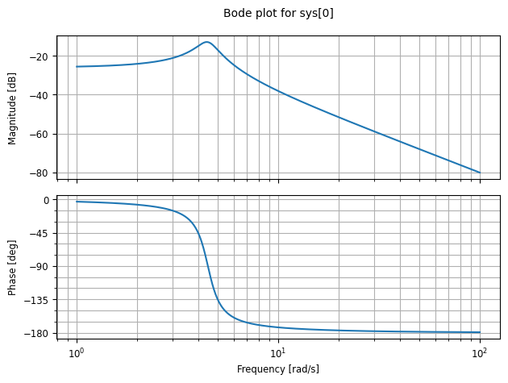
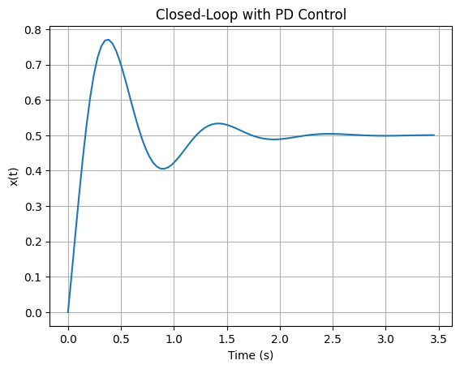

# 📘 Control Systems Dynamics — Simulation Project

This project explores the dynamics of a **mass–spring–damper control system** using Python.  
It includes step responses, damping effects, Bode plots, and a simple **PD controller** to analyze closed-loop behavior.

The simulations were implemented using:

- **Python**
- **NumPy**
- **Matplotlib**
- **python-control (`control` library)**

---

## 🔧 System Model

The plant is a classical **second-order mass–spring–damper system**:

\[
G(s) = \frac{1}{ms^2 + cs + k}
\]

Where:

- \( m = 1.0 \)  
- \( c = 1.0 \)  
- \( k = 20.0 \)

Natural frequency:
\[
\omega_n = \sqrt{\frac{k}{m}}
\]

Damping ratio:
\[
\zeta = \frac{c}{2\sqrt{mk}}
\]

---

## 📊 Simulation Results

### **1️⃣ Step Response — Case A (Underdamped)**  
Shows oscillatory behavior due to low damping.


---

### **2️⃣ Bode Plot of the Open-Loop System**

Displays magnitude and phase characteristics over frequency.



---

### **3️⃣ Effect of Increasing Damping**

Comparison between \( c = 1 \) (underdamped) and \( c = 6 \) (higher damping).


---

### **4️⃣ Closed-Loop Response with PD Controller**

PD Controller used:

\[
C(s) = K_d s + K_p
\]

Where:
- \( K_p = 20 \)  
- \( K_d = 3 \)



---

## 🧪 Code Snippet (Core Logic)

```python
import numpy as np
import matplotlib.pyplot as plt
import control as ctl

m, c, k = 1.0, 1.0, 20.0
G = ctl.tf([1.0], [m, c, k])

t, y = ctl.step_response(G)
plt.plot(t, y)
plt.title("Step Response: Case A")
plt.xlabel("Time (s)")
plt.ylabel("x(t)")
plt.grid(True)
plt.show()
Full implementation is available in the notebook:
MATLAB_SIMULINK.ipynb

📦 Installation
Install required libraries:

bash
Copy code
pip install control matplotlib numpy
🚀 Features
✔ Step response metrics (rise time, settling time, overshoot)

✔ Damping comparison for different 
𝑐
c values

✔ Bode plots & stability margins

✔ PD controller implementation and closed-loop analysis

✔ Clean, modular Python code

📁 File Structure
Copy code
control-systems-dynamics/
│
├── MATLAB_SIMULINK.ipynb
├── step_response_caseA.png
├── bode_plot_system.png
├── damping_comparison.png
├── closed_loop_PD_control.png
└── README.md
📌 Purpose
This project was created as a learning exercise in classical control engineering, focusing on system behavior visualization and controller effects.
